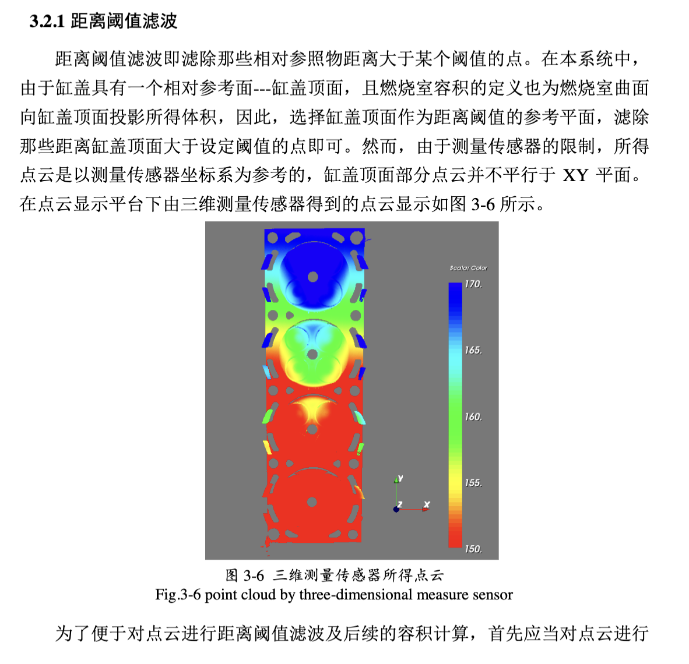
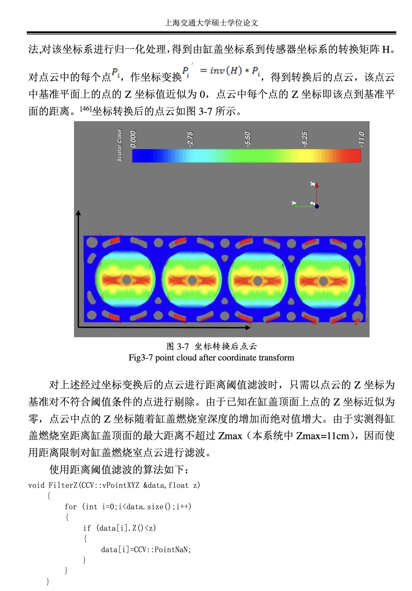

# 3.2.1 距离阈值滤波

## 距离阈值滤波原理

距离阈值滤波即滤除那些相对参照物距离大于某个阈值的点。在本系统中，由于缸盖具有一个相对参考面---缸盖顶面，且燃烧室容积的定义也为燃烧室曲面向缸盖顶面投影所得体积，因此，选择缸盖顶面作为距离阈值的参考平面，滤除那些距离缸盖顶面大于设定阈值的点即可。然而，由于测量传感器的限制，所得点云是以测量传感器坐标系为参考的，缸盖顶面部分点云并不平行于 XY 平面。

在点云显示平台下由三维测量传感器得到的点云显示如图 3-6 所示。


*Fig.3-6 point cloud by three-dimensional measure sensor*

为了便于对点云进行距离阈值滤波及后续的容积计算，首先应当对点云进行

## 坐标系转换

基于获取的点云，先对点云进行坐标变换系统与滤波处理，为了方便对坐标系表面进行配准或平移，需要对点云数据进行一次坐标系统转换。在点云处理中，我们将点云数据描述为三维空间中的点集合。

对点云进行坐标系转换的核心思想是：进行一系列的旋转、平移变换，把获得的点云坐标变换到一个新的坐标系统中，使得点云的位置更加适合后续处理。一般来说，我们希望将缸盖顶面平行于XY平面。

转换矩阵采用齐次坐标变换：

```
P' = T * P
```

其中T为变换矩阵，P为原始点坐标，P'为变换后的点坐标。

## 坐标变换后的点云

法对该坐标系进行一化处理，得到由缸盖坐标系到传感器坐标系的转换距离H。

对点云中的每个点P_i，作坐标变换P_i' = inv(H) * P_i，得到转换后的点云，该点云中基准平面上的点的Z坐标值近似为0。点云中每个点的Z坐标值该点到基准平面的距离。坐标转换后的点云如图3-7所示。


*Fig.3-7 point cloud after coordinate transform*

对上述经过坐标转换后的点云进行距离阈值滤波时，只需以点云的Z坐标为基准对不符合距离条件的点进行删除。由于已知缸盖顶面上的点的Z坐标近似为零，点云中点的Z坐标随着缸盖燃烧室深度的增加而绝对值增大，由于实测得缸盖燃烧室距离顶面的最大深度不超过Zmax（本系统中Zmax=11cm），因而使用距离限制对缸盖燃烧室点云进行滤波。

## 滤波算法

使用距离阈值滤波的算法如下：

```cpp
void FilterZ(CCV::vPointXYZ &data, float z)
{
    for (int i=0;i<data.size();i++)
    {
        if (data[i].Z0<z)
        {
            data[i]=CCV::PointNaN;
        }
    }
}
```

循环遍历所有点云中的点，对点云中点的Z坐标小于参数z时的情况进行滤波。在本系统中，设定参数为11。由于缸盖顶面孔洞内延伸点及部分由缸盖表面反光造成的点云离群点属于此种滤波类型，因此可以解决部分孔洞延伸点问题。
