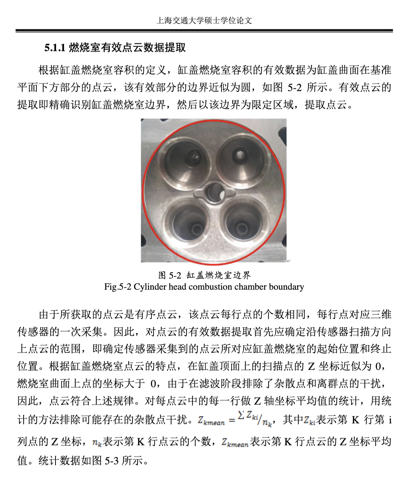
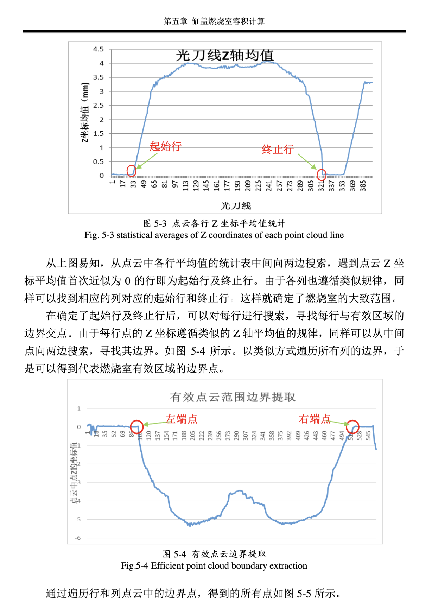
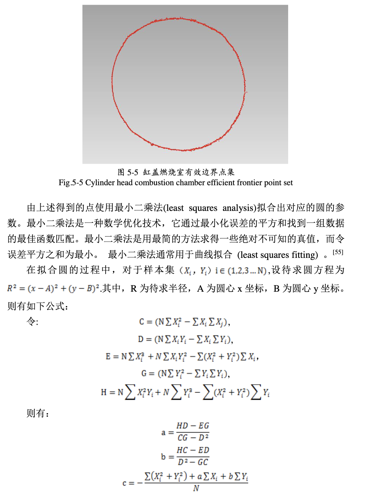
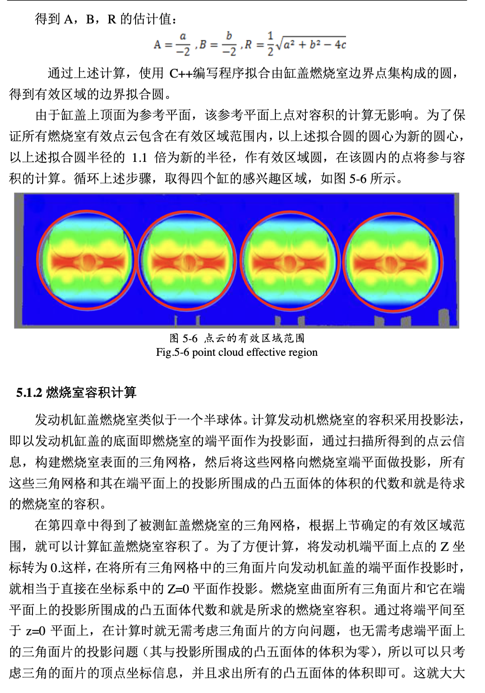

# 5.1.1 燃烧室有效点云数据提取

## 燃烧室边界识别

根据缸盖燃烧室容积的定义，缸盖燃烧室容积的有效数据为缸盖曲面在基准平面下方部分的点云，该有效部分的边界近似为圆，如图5-2所示，有效点云的提取即精确识别缸盖燃烧室边界，然后以该边界为限定区域，提取点云。

*Fig.5-2 Cylinder head combustion chamber boundary*

由于所获取的点云是有序点云，该点云每行点的个数相同，每行点对应三维传感器的一次采集。因此，对点云的有效数据提取自先应确定沿传感器扫描方向上点云的范围，即确定传感器采集到的点云所对应燃烧室的起始位置和终止位置。根据缸盖燃烧室点云的特点，在缸盖顶面上的扫描点的Z坐标近似为0，燃烧室曲面上点的坐标大于0，由于在滤波阶段排除了杂散点和离群点的干扰，因此，点云符合上述规律。对每点云中的每一行做Z轴坐标平均值的统计，用统计的方法排除可能存在的杂散点干扰。

**Z均值计算公式：**
Z_zmean = (1/n_k) * Σz_ki，其中z_ki表示第K行第i列点的Z坐标，n_k表示第K行点云的个数，z_zmean表示第K行点云的Z坐标平均值。统计数据如图5-3所示。

*Fig.5-3 statistical averages of Z coordinates of each point cloud line*

## 边界点提取

从上图得知，从点云中各行平均值的统计表中间两边现象，遍历点云Z坐标平均值首次近似为0的行即为起始行及终止行，由于各列也遵循类似规律，同样可以找到相应列对应的起始行和终止行。这样就确定了燃烧室的大致范围。

在确定了起始行及终止行后，可以对每行进行搜索，寻找每行与有效区域的边界交点。由于每行点的Z坐标遵循类似的Z轴平均值的规律，同样可以从中间向两边搜索，对两边的Z坐标，可用5-4所示，以类似方式遍历所有列的边界，下述可以得到代表燃烧室有效区域的边界点。

*Fig.5-4 Efficient point cloud boundary extraction*

通过遍历行和列点云中的边界点，得到的所有点如图5-5所示。

*Fig.5-5 Cylinder head combustion chamber efficient frontier point set*

## 最小二乘法圆拟合

由上述得到的点使用最小二乘法(least squares analysis)拟合出对应的圆的参数。最小二乘法是一种数学优化技术，它通过最小化误差的平方和找到一组数据的最佳函数匹配。最小二乘法是用最简的方法求得一些绝对不可知的真值，而令误差平方之和为最小。最小二乘法通常用于曲线拟合(least squares fitting)。

在拟合圆的过程中，对于样本集{X_i, Y_i} i∈{1,2,3...N}，设待求圆方程为：

**R² = (x - A)² + (y - B)²**

其中，R为待求半径，A为圆心x坐标，B为圆心y坐标。

则有如下公式：

令：
- C = (N∑X_i² - ∑X_i∑X_i)
- D = (N∑X_iY_i - ∑X_i∑Y_i)
- E = N∑X_i³ + N∑X_iY_i² - ∑(X_i² + Y_i²)∑X_i
- G = (N∑Y_i² - ∑Y_i∑Y_i)
- H = N∑X_i²Y_i + N∑Y_i³ - ∑(X_i² + Y_i²)∑Y_i

则有：
- a = (HD - EG)/(CG - D²)
- b = (HC - ED)/(D² - GC)
- c = -[∑(X_i² + Y_i²) + a∑X_i + b∑Y_i]/N

得到A, B, R的估计值：
- A = a/2
- B = b/2  
- R = (1/2)√(a² + b² - 4c)

## 有效区域确定

通过上述计算，使用C++编写程序拟合出缸盖燃烧室边界点集构成的圆，得到有效区域的边界拟合圆。

由于缸盖上顶面为参考平面，该参考平面上点对容积的计算无影响。为了保证所有有效点云包含在有效区域范围内，以上述拟合圆半径的1.1倍为新的半径，作为有效区域圆，在该圆内的点将参与容积的计算。循环上述步骤，取得四个值对应区域，如图5-6所示。

*Fig.5-6 point cloud effective region*

## 5.1.2 燃烧室容积计算

发动机缸盖燃烧室类似于一个半球体，计算发动机燃烧室的容积采用投影法，即以发动机缸盖的底面即燃烧室的端平面作为投影面，通过扫描得到的点云信息，构建燃烧室表面的三角网格，然后将这些网格向燃烧室端平面做投影，所有这些三角网格和其在端平面上的投影所围成的凸五面体的体积和就是所求的燃烧室的容积。

在第四章中得到了被测缸盖燃烧室的三角网格，根据上节确定的有效区域范围，就可以计算缸盖燃烧室容积了。为了方便计算，将发动机端平面上点的Z坐标设为0这样，在将所有三角网格中的三角面片向发动机缸盖的端平面作投影时，就相当于直接在燃烧室邻近的Z=0平面上投影。燃烧室曲面所有三角面片和它在端平面上的投影所围成凸五面体向端平面做投影，所有这些三角面片的投影问题，也无需考虑端平面上的三角面片的投影问题（其投影即为端平面上的三角面体本身）。所以可以只考虑三角面片的顶点坐标信息，并且求出所有的凸五面体的体积即可。这就大大