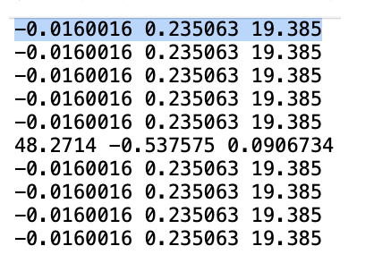

大作业内容及要求

大作业包含数值数据分析和图像数据分析两个部分。数据集来源于汽车发动机缸盖点云数据，根据学号最后一位选择对应编号的点云数据。

1.数值数据分析

该点云通过线激光扫描得到，整个缸盖表面由1280条激光线构成，每条激光线包含640个点。在测量过程中，存在无效点和未测量到的点，均通过固定坐标点标记，例如数据1中的（-0.0160016，0.235063，19.385）。理论测量点：从第一个点开始，每间隔四个点均为理论测量点。

需要注意：无效点可以直接去掉，但是未测量到的点要保留。以数据1为例，前十个点中应该有2个有效点，但是第一个点未测量到，所以用固定坐标代替。

目标：将一个燃烧室点云数据从缸盖点云中分离出来。过程包括：数据预处理，边界点识别与拟合（最小二乘法，得到拟合轮廓和半径），分离出燃烧室点云。

处理该数据需要参考的文献：

[1]祁鸣东.汽车发动机缸盖燃烧室容积数字化计量技术研究[D].上海交通大学,2014.

 **数据预处理：**  **3.2.1**  **～** **3.2.3**

 **点云分离：** **5.1.1**

2.图像数据分析

将得到的缸盖点云数据投影到XY平面并保存为二维图像，将该图像转换为灰度图像，并对该图像进行边缘检测和轮廓提取。

3.提交文件：

Python代码和分析报告。其中，报告应包含结果的截图、完整的处理步骤以及必要的文字说明。
