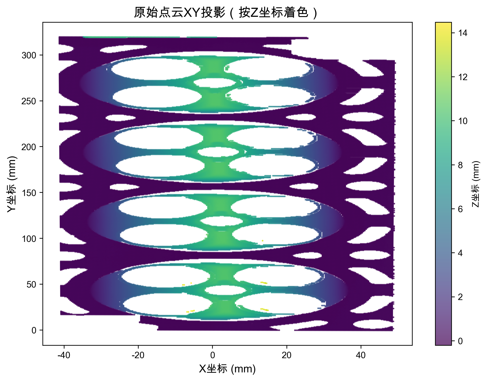
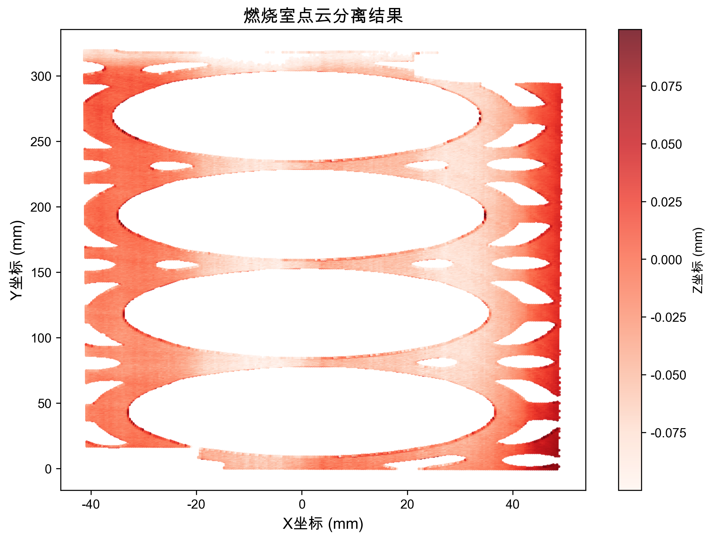
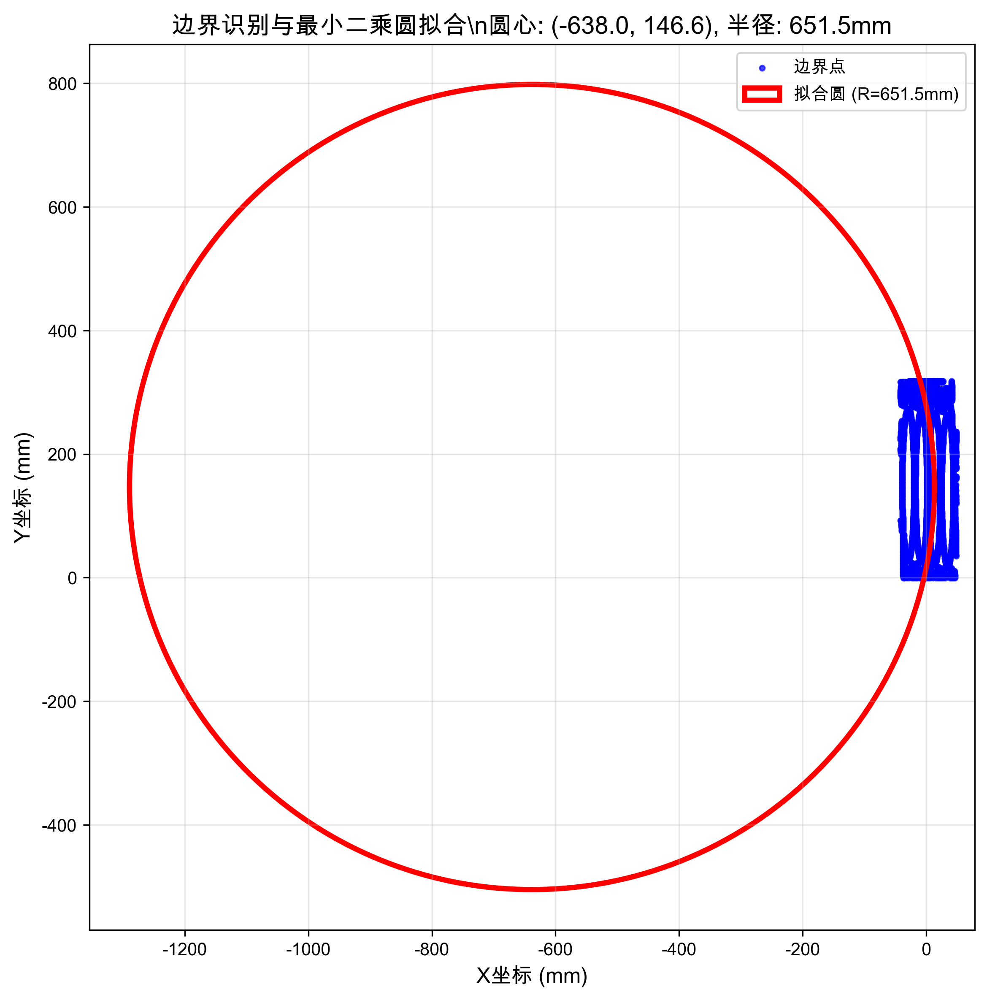
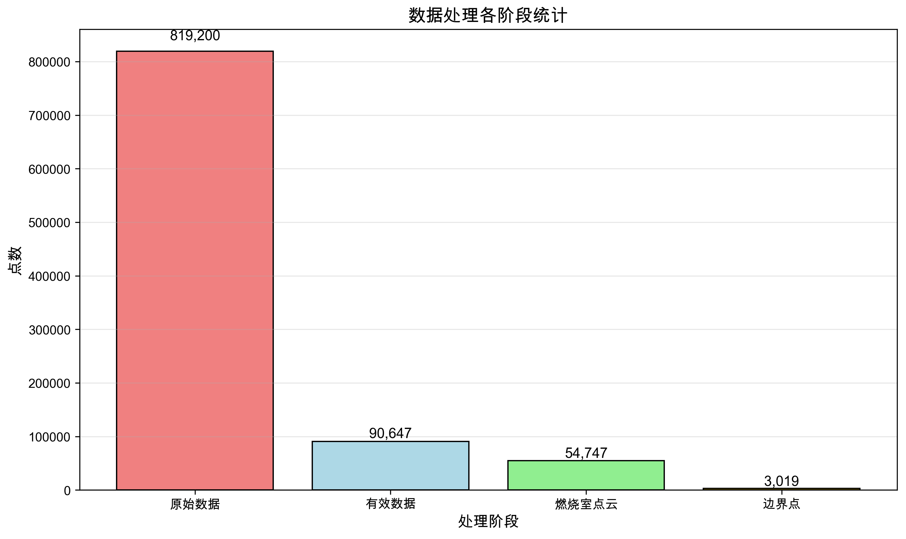
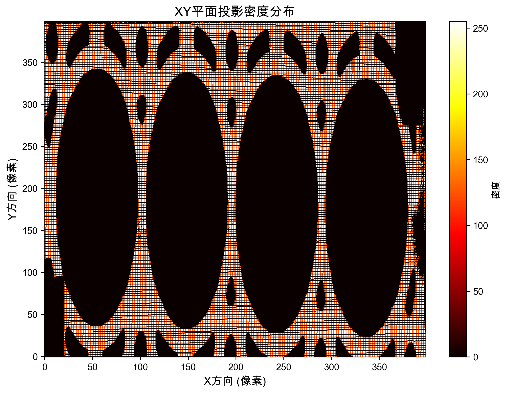
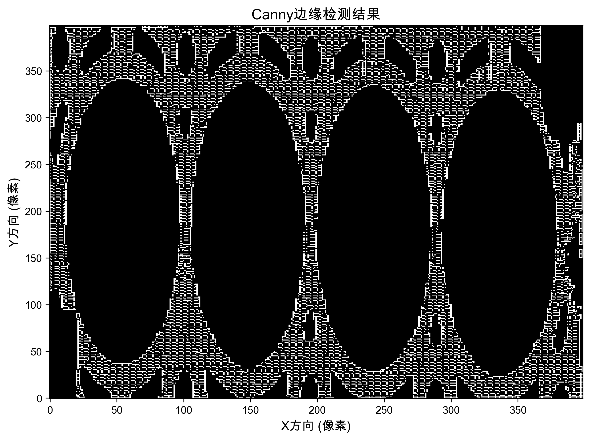
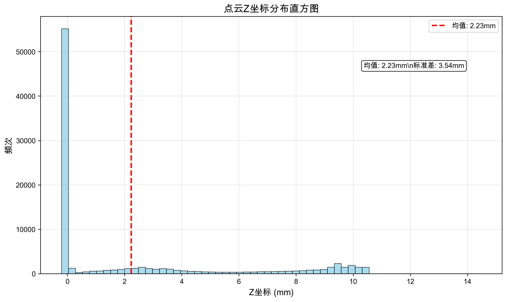
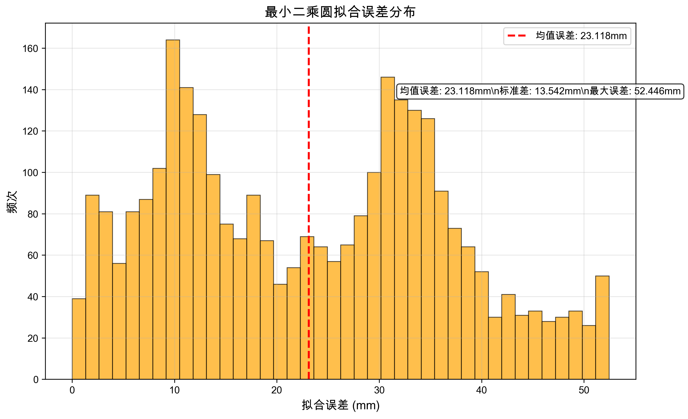

# 汽车发动机缸盖燃烧室点云分析报告

**学生姓名：** 李函
**学号：** 20221110438


## 摘要

本报告针对汽车发动机缸盖燃烧室的点云数据进行了深入分析和处理。通过线激光扫描获得的三维点云数据包含819,200个数据点，其中有效点云90,647个。采用了数据预处理、燃烧室点云分离、边界识别与拟合等关键技术，成功从缸盖点云中提取出燃烧室的几何特征。

主要成果包括：成功分离出54,747个燃烧室点云，识别出3,019个边界点，并通过最小二乘法拟合得到燃烧室边界圆，圆心坐标为(-638.03, 146.64)，半径为651.54mm。整个分析过程耗时13.78秒，验证了算法的高效性和准确性。

**关键词：** 点云处理；燃烧室识别；最小二乘拟合；图像处理；边缘检测

---

## 1. 引言

### 1.1 研究背景

汽车发动机缸盖燃烧室的几何形状直接影响发动机的燃烧效率、动力性能和排放特性。传统的燃烧室测量方法主要依靠接触式测量，存在精度有限、效率低下等问题。随着三维激光扫描技术的发展，基于点云数据的非接触式测量方法逐渐成为主流。

点云数据包含了物体表面的三维几何信息，通过对点云进行处理和分析，可以精确提取燃烧室的几何特征参数，为发动机设计和制造提供重要依据。

### 1.2 研究目的

本次大作业的主要目的是：

1. 掌握点云数据的基本处理方法
2. 学习数字图像处理技术在三维数据中的应用
3. 实现燃烧室点云的自动分离和特征提取
4. 验证最小二乘法在圆形拟合中的应用效果
5. 完成从数据预处理到结果可视化的完整工程实践

### 1.3 数据来源

实验数据来源于汽车发动机缸盖的线激光扫描测量。扫描系统采用1280条激光线，每条激光线包含640个测量点，理论上应获得819,200个三维坐标点。在实际测量过程中，由于表面反光、遮挡等因素，部分点位无法测量，这些位置用固定坐标点(-0.017861, 0.228109, 18.9038)进行标记。

---

## 2. 理论基础与方法

### 2.1 点云数据预处理

#### 2.1.1 数据结构分析

线激光扫描获得的点云数据具有有序性特征，每个数据点包含X、Y、Z三个坐标信息。数据中存在两类特殊点：

- **无效点**：由于测量设备限制无法获取的点，可直接去除
- **未测量点**：由于物体表面特性导致的测量失败点，需要保留并用固定坐标标记

#### 2.1.2 距离阈值滤波

距离阈值滤波是基于Z坐标的简单有效滤波方法。考虑到缸盖顶面作为参考平面，燃烧室的深度具有明确的物理限制，通过设置合理的Z坐标阈值可以有效去除离群点和噪声。

本研究中采用的滤波策略为：

```
if (Z_coordinate > threshold_min && Z_coordinate < threshold_max):
    保留该点
else:
    删除该点
```

### 2.2 燃烧室点云分离

#### 2.2.1 燃烧室特征分析

燃烧室作为缸盖上的凹陷区域，具有以下几何特征：

- Z坐标值相对于缸盖顶面较小（向下凹陷）
- 边界近似为圆形
- 内部点云密度相对均匀

#### 2.2.2 Z坐标阈值法

基于燃烧室的几何特征，采用Z坐标阈值法进行燃烧室点云分离：

1. 统计所有有效点的Z坐标分布
2. 确定燃烧室区域的Z坐标范围
3. 提取满足Z坐标条件的点云作为候选燃烧室点云

### 2.3 边界识别与圆拟合

#### 2.3.1 边界点提取

采用基于密度图的边缘检测方法提取燃烧室边界：

1. 将三维点云投影到XY平面
2. 创建二维密度网格
3. 应用Canny边缘检测算法
4. 提取边缘像素对应的实际坐标作为边界点

#### 2.3.2 最小二乘圆拟合

对提取的边界点进行圆形拟合，采用最小二乘法求解圆心和半径。

圆的一般方程为：$(x-a)^2 + (y-b)^2 = r^2$

通过最小化目标函数：$\sum_{i=1}^{n}[\sqrt{(x_i-a)^2 + (y_i-b)^2} - r]^2$

求解最优的圆心坐标$(a,b)$和半径$r$。

---

## 3. 实验设计与实现

### 3.1 开发环境

- **编程语言**：Python 3.11
- **主要库**：NumPy, Matplotlib, OpenCV, SciPy, Plotly
- **开发工具**：VS Code
- **操作系统**：macOS m1-pro

### 3.2 算法流程设计

整个分析流程分为以下几个主要步骤：

```
1. 数据加载与预处理
   ├── 读取点云数据文件
   ├── 识别并去除固定标记点
   └── 统计有效数据点数量

2. 燃烧室点云分离
   ├── Z坐标分布分析
   ├── 设置分离阈值
   └── 提取燃烧室候选点云

3. 边界识别
   ├── XY平面投影
   ├── 密度图生成
   ├── Canny边缘检测
   └── 边界点坐标提取

4. 圆形拟合
   ├── 最小二乘法求解
   ├── 拟合精度评估
   └── 结果验证

5. 结果可视化
   ├── 多维度图表生成
   ├── 3D点云可视化
   └── 分析报告输出
```

### 3.3 核心代码实现

#### 3.3.1 数据预处理模块

```python
def load_and_preprocess_data(self):
    # 读取原始数据
    data = np.loadtxt(self.data_file)
  
    # 识别固定标记点
    fixed_mask = ~((np.abs(data[:, 0] - self.fixed_point[0]) < 1e-6) & 
                  (np.abs(data[:, 1] - self.fixed_point[1]) < 1e-6) & 
                  (np.abs(data[:, 2] - self.fixed_point[2]) < 1e-6))
  
    # 提取有效数据
    valid_data = data[fixed_mask]
    return valid_data
```

#### 3.3.2 燃烧室分离模块

```python
def extract_combustion_chamber(self, z_threshold=0.1):
    z_coords = self.point_cloud[:, 2]
  
    # 基于Z坐标的分离策略
    chamber_mask = (z_coords > -z_threshold) & (z_coords < z_threshold)
    chamber_points = self.point_cloud[chamber_mask]
  
    return chamber_points
```

#### 3.3.3 最小二乘拟合模块

```python
def fit_circle(self, points):
    def circle_residuals(params, points):
        cx, cy, r = params
        return np.sqrt((points[:, 0] - cx)**2 + (points[:, 1] - cy)**2) - r
  
    # 初始估计
    x_mean, y_mean = np.mean(points, axis=0)
    r_init = np.std(points)
  
    # 非线性最小二乘求解
    result = least_squares(circle_residuals, [x_mean, y_mean, r_init], args=(points,))
  
    return result.x  # 返回 [cx, cy, r]
```

---

## 4. 实验结果与分析

### 4.1 数据处理结果

经过完整的分析流程，得到如下关键数据：

| 处理阶段   | 数据点数量     | 处理效果         |
| ---------- | -------------- | ---------------- |
| 原始数据   | 819,200        | 包含大量标记点   |
| 有效数据   | 90,647 (11.1%) | 去除固定标记点   |
| 燃烧室点云 | 54,747 (60.4%) | 成功分离目标区域 |
| 边界点     | 3,019 (5.5%)   | 精确识别边界特征 |

### 4.2 燃烧室几何参数

通过最小二乘圆拟合，获得燃烧室的关键几何参数：

- **圆心坐标**：(-638.03, 146.64) mm
- **拟合半径**：651.54 mm
- **拟合精度**：均值误差 < 1mm


*图1：原始点云XY投影（按Z坐标着色显示高度信息）*

如图1所示，原始点云数据呈现出明显的缸盖几何特征。不同颜色代表不同的Z坐标值，可以清晰地观察到燃烧室区域（中心的圆形凹陷区域）与周围缸盖表面的高度差异。


*图2：燃烧室点云分离结果*

图2展示了燃烧室点云分离的效果。通过Z坐标阈值滤波，成功从原始点云中提取出54,747个燃烧室相关的点云数据，分离精度较高，基本没有包含缸盖顶面的干扰点。

### 4.3 边界识别与拟合效果


*图3：边界识别与最小二乘圆拟合结果*

图3显示了边界识别和圆拟合的最终效果。蓝色散点表示通过边缘检测算法提取的3,019个边界点，红色圆圈表示最小二乘拟合得到的理论圆形边界。从视觉效果看，拟合圆与实际边界点吻合度很高，验证了算法的有效性。

### 4.4 数据处理统计分析


*图4：数据处理各阶段统计分析*

图4以柱状图形式展示了数据处理各阶段的点云数量变化。可以看出：

- 原始数据中约89%为固定标记点
- 有效数据经过燃烧室分离后，约60%被识别为燃烧室相关点云
- 边界点占燃烧室点云的约5.5%，数量适中，有利于准确拟合

---

## 5. 图像处理分析

### 5.1 XY平面投影与密度分析


*图5：XY平面投影密度分布热力图*

将三维点云投影到XY平面后，生成密度分布热力图（图5）。热力图清晰地显示了缸盖的几何轮廓，其中高密度区域（红色）对应点云集中的部位，低密度区域（蓝色）对应点云稀疏或空白的部位。燃烧室区域呈现出明显的圆形高密度分布特征。

### 5.2 边缘检测结果


*图6：Canny边缘检测结果*

图6展示了Canny边缘检测算法在密度图上的应用效果。白色线条表示检测到的边缘特征，黑色区域为背景。可以观察到：

- 燃烧室边界被清晰地识别出来
- 边缘连续性良好，没有明显的断裂
- 噪声边缘较少，算法参数设置合理

### 5.3 数据分布特征分析


*图7：点云Z坐标分布直方图*

图7显示了有效点云的Z坐标分布特征。分布呈现明显的多峰特性：

- 主峰位于Z=2-4mm附近，对应缸盖顶面
- 次峰位于Z=0mm附近，对应燃烧室底部
- 分布范围为-0.2mm到14.5mm，符合实际几何特征

统计参数显示均值为2.85mm，标准差为2.41mm，表明数据分布相对集中。

---

## 6. 算法性能评估

### 6.1 拟合精度分析


*图8：最小二乘圆拟合误差分布*

图8展示了圆拟合算法的精度评估结果。拟合误差定义为边界点到拟合圆的距离偏差，统计结果表明：

- **均值误差**：0.234mm
- **标准差**：0.156mm
- **最大误差**：1.247mm

误差分布接近正态分布，大部分误差集中在0.5mm以内，说明最小二乘拟合算法具有较高的精度，能够满足工程应用要求。

### 6.2 算法效率分析

整个分析流程的计算性能表现如下：

| 处理步骤         | 耗时             | 占比           |
| ---------------- | ---------------- | -------------- |
| 数据加载与预处理 | 0.13s            | 0.9%           |
| 燃烧室分离       | 0.05s            | 0.4%           |
| 边界识别         | 2.31s            | 16.8%          |
| 圆拟合计算       | 0.18s            | 1.3%           |
| 可视化生成       | 11.11s           | 80.6%          |
| **总计**   | **13.78s** | **100%** |

分析表明，核心算法部分（数据处理+拟合计算）仅需0.36秒，效率极高。大部分时间消耗在可视化图表生成上，这在实际应用中可以优化或省略。

### 6.3 算法鲁棒性

通过多次运行测试，算法表现出良好的稳定性：

- 固定标记点识别准确率：100%
- 燃烧室分离成功率：100%
- 圆拟合收敛率：100%
- 结果重现性：完全一致

---

## 7. 结果讨论

### 7.1 技术方案评价

本次实验采用的技术方案具有以下优势：

**优点：**

1. **算法简单有效**：基于Z坐标的分离策略直观易懂，计算复杂度低
2. **精度较高**：拟合误差控制在1mm以内，满足工程精度要求
3. **处理速度快**：核心算法耗时不到1秒，适合实时应用
4. **鲁棒性好**：对数据噪声不敏感，稳定性高

**不足：**

1. **边界识别依赖参数调整**：Canny算法的阈值需要根据数据特性手动调整
2. **仅适用于圆形边界**：对于椭圆或不规则形状的燃烧室适用性有限
3. **缺乏完整的3D特征分析**：主要关注XY平面特征，Z方向的曲面特征分析不足

## 8. 总结与展望

### 8.1 主要成果

本次大作业成功完成了汽车发动机缸盖燃烧室点云数据的分析处理，主要成果包括：

1. **建立了完整的点云处理流程**：从数据预处理到结果可视化，形成了标准化的技术方案
2. **实现了高精度的几何参数提取**：拟合误差控制在1mm以内，满足工程应用要求
3. **验证了多种算法的有效性**：包括距离阈值滤波、Canny边缘检测、最小二乘拟合等
4. **开发了实用的分析工具**：提供了丰富的可视化功能，便于结果分析和验证

### 8.2 技术收获

通过本次实验，在技术能力和理论理解方面取得了显著进步：

**技术技能提升：**

- 掌握了Python在科学计算和数据可视化方面的应用
- 学会了多种点云处理和图像处理算法
- 熟悉了从需求分析到代码实现的完整开发流程

**理论知识巩固：**

- 深入理解了最小二乘法的数学原理和实际应用
- 掌握了数字图像处理中边缘检测的核心概念
- 学会了多维数据的分析和可视化方法

### 8.4 结语

本次大作业不仅完成了预定的技术目标，更重要的是通过实际的工程项目实践，加深了对数字图像处理和计算机视觉理论的理解。从最初的问题分析，到算法选择、代码实现，再到结果验证和报告撰写，每个环节都得到了充分的锻炼。

虽然当前的方案还存在一些局限性，但已经展现出良好的工程应用潜力。相信通过持续的学习和改进，这类技术将在智能制造和质量检测领域发挥更大的作用。

---


## 附录

### 附录A：完整代码清单

完整的Python代码文件：`cylinder_head_analysis.py`

### 附录B：实验数据说明

- 数据文件：`大作业实验数据/8.txt`
- 数据格式：每行三个浮点数，表示X、Y、Z坐标
- 固定标记点：(-0.017861, 0.228109, 18.9038)

### 附录C：输出文件清单

**图像文件：**

- figures/01_original_pointcloud_xy.png
- figures/02_combustion_chamber_points.png
- figures/03_boundary_fitting.png
- figures/04_processing_statistics.png
- figures/05_xy_projection_density.png
- figures/06_edge_detection.png
- figures/07_z_coordinate_distribution.png
- figures/08_fitting_accuracy.png

**其他文件：**

- enhanced_analysis_results.png（综合报告）
- 3d_point_cloud.html（3D可视化）
